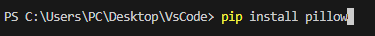
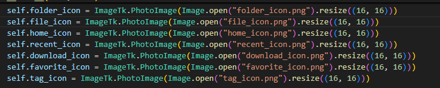
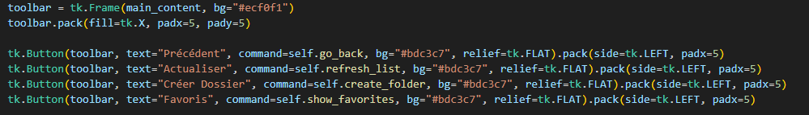
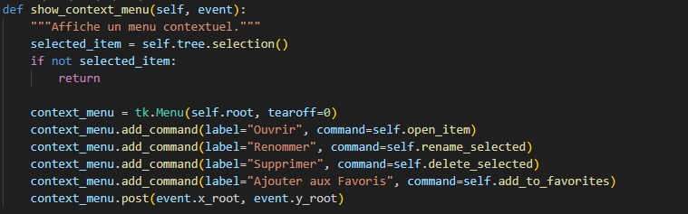

# Explorateur de Fichiers en Python avec Tkinter

## *Membres du groupe*
- ADJABA Ayodélé
- AGELE Delore
- DAFIA Jonas
- HOUANDJA Stéphanie
- KOUTCHIKA Harahel

## Description
Nous avons développé une application d'explorateur de fichiers en Python, utilisant l'interface graphique Tkinter. Cette application permet de naviguer, gérer et organiser les fichiers et dossiers de notre système de manière simple et intuitive. Elle offre des fonctionnalités telles que la navigation dans les dossiers, la gestion des favoris, des fichiers récents, la recherche et le filtrage des fichiers, ainsi que la gestion des tags.

## Fonctionnalités
- *Navigation dans les dossiers* : Accédez facilement à vos fichiers et dossiers.
- *Favoris* : Ajoutez des dossiers et fichiers aux favoris pour un accès rapide.
- *Fichiers récents* : Consultez les fichiers récemment ouverts.
- *Téléchargements* : Affichez le répertoire de téléchargements.
- *Recherche* : Recherchez des fichiers et dossiers par nom.
- *Filtrage* : Filtrez les fichiers par type (images, texte, PDF, vidéos).
- *Création de dossiers* : Créez de nouveaux dossiers directement depuis l'interface.
- *Gestion des tags* : Ajoutez et gérez des tags pour organiser vos fichiers.
- *Contexte* : Menu contextuel pour des actions supplémentaires sur les fichiers (ouvrir, renommer, supprimer, ajouter aux favoris).

## Prérequis
- Python 3.x
- Tkinter (généralement inclus avec Python)
- Pillow (pour la gestion des icônes)

### Documentation des Problèmes et Solutions

#### 1. Problème : Chargement des icônes
Description : Les icônes pour les dossiers et fichiers n'étaient pas chargées correctement, entraînant des erreurs d'affichage.

Solution : Vérifiez que les fichiers d'icônes sont présents dans le même répertoire que le script Python et utilisez la bibliothèque PIL (Pillow) pour redimensionner les icônes avant de les afficher.

#### 2. Problème : Permissions d'accès aux répertoires
Description : Des erreurs de permission se produisaient lors de l'accès à certains répertoires.

Solution : Utilisez un bloc try-except pour gérer les exceptions PermissionError, affichant un message d'erreur convivial à l'utilisateur.

#### 3. Problème : Filtrage des fichiers
Description : Le filtrage des fichiers par type ne fonctionnait pas correctement.

Solution : Créez un dictionnaire pour mapper les types de fichiers à leurs extensions respectives.

#### 4. Problème : Ouverture de fichiers
Description : L'ouverture de fichiers avec os.startfile() ne fonctionnait pas sur certains systèmes d'exploitation.

Solution : Utilisez une approche conditionnelle pour ouvrir des fichiers en fonction du système d'exploitation.

#### 5. Problème : Suppression de dossiers non vides
Description : La tentative de suppression de dossiers non vides entraînait une erreur.

Solution : Utilisez shutil.rmtree() pour supprimer des dossiers non vides.

#### 6. Problème : Renommage de fichiers
Description : Le renommage de fichiers échouait parfois en raison de conflits de noms.

Solution : Ajoutez une vérification pour voir si le nouveau nom existe déjà avant de renommer

#### 7. Problème : Choix des couleurs
Description : Lors de la modification de l'interface utilisateur pour inclure des couleurs, il était nécessaire de choisir des couleurs qui soient à la fois esthétiques et fonctionnelles, tout en garantissant une bonne lisibilité.

Solution : Nous avons opté pour une palette de couleurs sombres pour le fond et des couleurs claires pour le texte afin d'améliorer le contraste. Par exemple, le fond du panneau latéral a été défini sur #2c3e50 et le texte sur white.
  
sidebar = tk.Frame(main_frame, width=200, bg="#2c3e50", relief=tk.SUNKEN)
tk.Label(sidebar, text="Navigation", bg="#2c3e50", fg="white", font=("Arial", 12, "bold")).pack(pady=10)

#### 8. Problème : Application des couleurs à la barre d'outils
Description : Initialement, la barre d'outils n'avait pas de couleur de fond, ce qui la rendait peu visible par rapport au reste de l'interface.

Solution : Nous avons ajouté une couleur de fond sombre à la barre d'outils pour qu'elle se démarque. La couleur choisie est #1a2a3a, qui s'harmonise avec le reste de l'interface.

toolbar = tk.Frame(main_content, bg="#1a2a3a")

#### 9. Problème : Couleurs des boutons
Description :Les boutons de l'interface n'avaient pas de couleur de fond, ce qui les rendait moins attrayants et moins visibles.

Solution : Nous avons défini une couleur de fond pour les boutons, en utilisant #34495e pour le panneau latéral et #1a2a3a pour la barre d'outils. Cela a permis d'améliorer l'esthétique et la visibilité des boutons.

tk.Button(sidebar, text="Accueil", command=self.go_home, bg="#34495e", fg="white", relief=tk.FLAT, image=self.home_icon, compound=tk.LEFT).pack(fill=tk.X, padx=10, pady=5)

#### 10. Problème : Lisibilité du texte
Description : Avec l'ajout de couleurs sombres, il était crucial de s'assurer que le texte reste lisible sur les fonds colorés.

Solution : Nous avons utilisé une couleur de texte claire (white) pour tous les éléments de texte afin d'assurer un bon contraste avec les fonds sombres.

tk.Label(search_frame, text="Rechercher :", bg="#1a2a3a", fg="white").pack(side=tk.LEFT, padx=5)

#### 11. Problème : Uniformité des couleurs
Description : Il était important de maintenir une uniformité dans l'utilisation des couleurs à travers toute l'application pour une meilleure expérience utilisateur.

Solution :Nous avons défini des couleurs spécifiques pour chaque élément de l'interface (panneaux, boutons, texte) et nous nous sommes assurés de les appliquer de manière cohérente dans tout le code.

tk.Button(toolbar, text="Actualiser", command=self.refresh_list, bg="#1a2a3a", fg="white", relief=tk.FLAT).pack(side=tk.LEFT, padx=5)

#### Conclusion
Ces modifications ont permis d'améliorer l'esthétique et la convivialité de l'application. En choisissant des couleurs appropriées et en assurant une bonne lisibilité, nous avons créé une interface utilisateur plus agréable et fonctionnelle.

### Étape 1 : Prérequis

Avant de commencer, assurez-vous d'avoir installé Python sur votre machine. Vous pouvez télécharger Python depuis le site officiel : [python.org](https://www.python.org/downloads/).

# Vérifiez si Python est installé
python --version

### Étape 2 : Installer les bibliothèques nécessaires

Le projet utilise la bibliothèque Pillow pour la gestion des images. Vous devez l'installer via pip. Ouvrez votre terminal ou votre invite de commande et exécutez la commande suivante :

bash
pip install Pillow

### Étape 3 : Préparer les icônes

Le projet utilise plusieurs icônes pour représenter les dossiers et fichiers. Vous devez vous assurer que les fichiers d'icônes suivants sont présents dans le même répertoire que votre script Python :

- folder_icon.png
- file_icon.png
- home_icon.png
- recent_icon.png
- download_icon.png
- favorite_icon.png
- tag_icon.png

### Étape 4 : Exécuter le script

Une fois que vous avez installé les dépendances et préparé les icônes, vous pouvez exécuter le script. Ouvrez votre terminal ou votre invite de commande, naviguez jusqu'au répertoire contenant le script et exécutez la commande suivante :

bash
python explorateur.py

### Étape 5 : Utilisation de l'application

Une fois l'application lancée, vous verrez une interface graphique avec plusieurs options. Voici quelques fonctionnalités clés :

- *Navigation* : Utilisez le panneau latéral pour naviguer entre les répertoires.
- *Barre d'outils* : Utilisez les boutons pour créer des dossiers, actualiser la liste, etc.
- *Recherche et filtrage* : Recherchez des fichiers et filtrez par type.
- *Favoris et fichiers récents* : Accédez rapidement à vos fichiers favoris et récents.

### Étape 6 : Gestion des fichiers

Vous pouvez ouvrir, renommer, supprimer des fichiers et dossiers, et les ajouter à vos favoris en utilisant le menu contextuel (clic droit sur un élément).

## Conclusion
En conclusion, ce projet d'Explorateur de Fichiers en Python avec Tkinter représente une étape significative dans notre apprentissage de la programmation et du développement d'applications. Grâce à notre collaboration, nous avons créé une application fonctionnelle qui facilite la gestion des fichiers de manière intuitive
